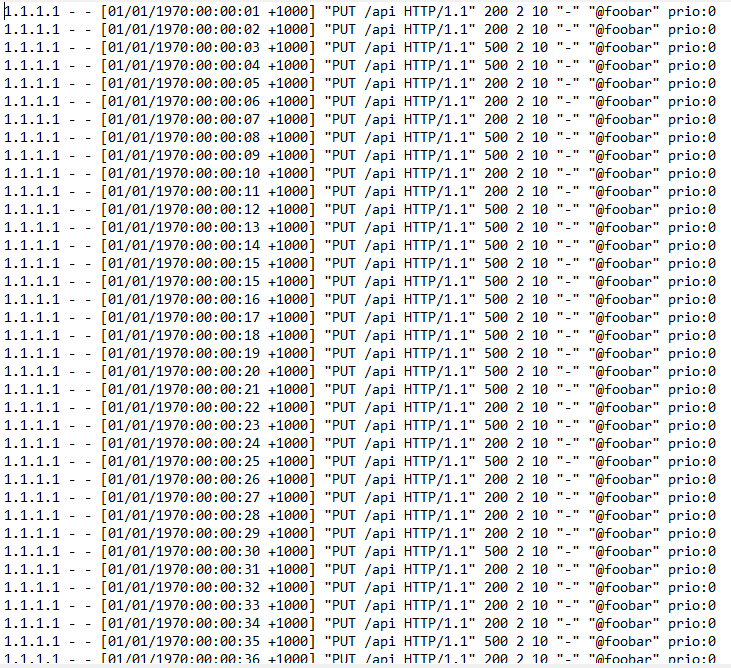
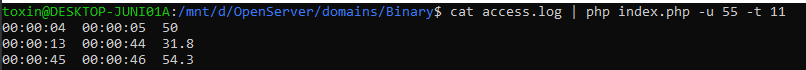

#Тестовое задание: анализ отказов
***
##Обзор
Проект читает access-лог и выполняет анализ отказов. Отказом считается запрос, код которого в диапазоне от 500 до 599, или его время обработки было выше заданного. Проверка осуществляется путём ввода команды в консольную строку:

~~~
 cat access.log | php index.php -u 90 -t 11
~~~
Где 

**cat access.log** - выполняет открытие заданного файла.

**php index.php** - это вызов PHP файла который и будет обрабатывать запросы.

**-u** - уровень доступности. Если на этапе просмотра найдётся момент когда уровень доступности станет ниже, это выведется в консоль.

**-t** - время обработки запроса. Если на этапе просмотра найдётся момент когда время обработки запроса станет выше заданного, это будет считаться отказом.

***
##Пример

Допустим у нас есть вот такой access-файл

Введя команду, мы получим такой результат.

1-запрос  0-с отказом  100-уровень доступности

2-запроса  0-с отказом  100-уровень доступности

3-запроса  1-с отказом  66.666666666667

4-запроса  2-с отказом  50 - на момент четвёртого запроса уровень доступности меньше 55 ведь всего запросов 4, отказов 2. Это начало.

5-запросов  2-с отказом  60 - уже на следующем запросе становиться больше 55. Это конец интервала можно выводить.

00:00:04  00:00:05  50

По такому же принципу алгоритм проходит по всему файлу.

Во время разработки было не до конца понятно какой уровень доступности выводить. Было два варианта.

1. Выводить наименьший уровень доступности, который был зафиксирован на интервале
2. Выводить уровень доступности за момент до преодоления границы.

Выбрал по итогу сразу 2. Для обычного интервала находим наименьший уровень доступности, ведь иначе всегда показывался один и тот результат: граница - 1.
Но если так вышло, что после анализа всего файла, уровень доступности так и не поднялся выше заданного, тогда мы выводим тот который был на момент последнего запроса.

***
##Установка

~~~
composer require toxin/analyze_access.log:@dev
~~~
Перекинуть все файлы из vendor/toxin/analyze_access.log в корень проекта
~~~
composer dump-autoload -o
~~~